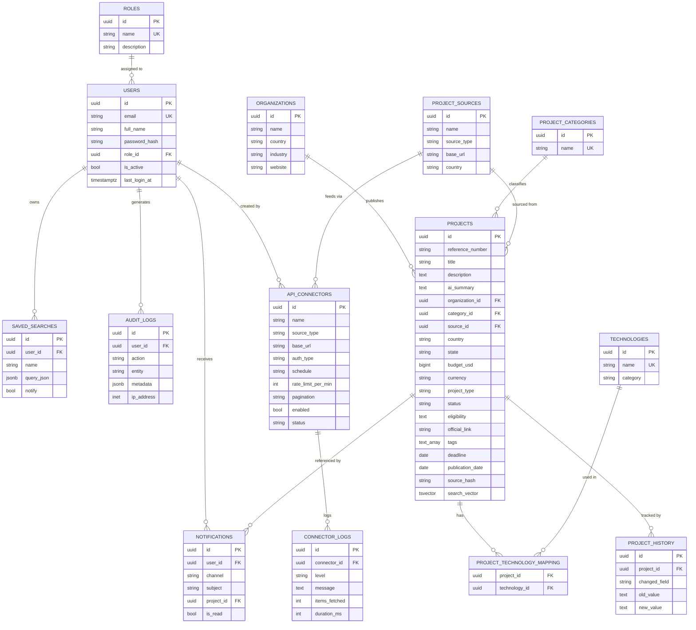

# Entity–Relationship Diagram

> Renders on GitHub / any Mermaid viewer. All PKs are `UUID`; every business
> table carries `created_at, updated_at, created_by, updated_by, deleted_at`
> (omitted below for readability).

## Scale & performance notes

| Concern | Design decision |
|---|---|
| Millions of projects | `projects` is **range-partitioned by `publication_date`** (monthly); automate with `pg_partman`. |
| Full-text search | `search_vector TSVECTOR` (weighted title/description/tags) + **GIN** index, maintained by trigger. |
| Autocomplete | `pg_trgm` GIN index on `title`. |
| Soft delete | `deleted_at IS NULL` **partial indexes** keep hot paths lean. |
| Append-only logs | **BRIN** indexes on `created_at` — tiny footprint at billions of rows. |
| Read scaling | Read replicas for analytics; OpenSearch mirror for cross-field relevance search. |
